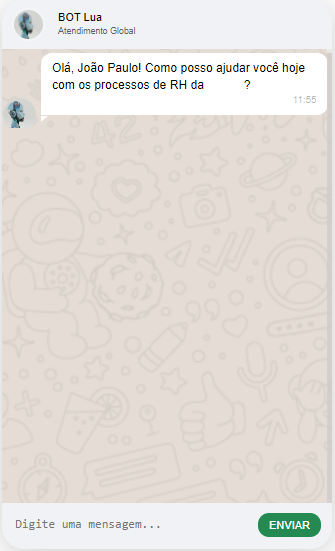

[![Built With Stencil](https://img.shields.io/badge/-Built%20With%20Stencil-16161d.svg?logo=data%3Aimage%2Fsvg%2Bxml%3Bbase64%2CPD94bWwgdmVyc2lvbj0iMS4wIiBlbmNvZGluZz0idXRmLTgiPz4KPCEtLSBHZW5lcmF0b3I6IEFkb2JlIElsbHVzdHJhdG9yIDE5LjIuMSwgU1ZHIEV4cG9ydCBQbHVnLUluIC4gU1ZHIFZlcnNpb246IDYuMDAgQnVpbGQgMCkgIC0tPgo8c3ZnIHZlcnNpb249IjEuMSIgaWQ9IkxheWVyXzEiIHhtbG5zPSJodHRwOi8vd3d3LnczLm9yZy8yMDAwL3N2ZyIgeG1sbnM6eGxpbms9Imh0dHA6Ly93d3cudzMub3JnLzE5OTkveGxpbmsiIHg9IjBweCIgeT0iMHB4IgoJIHZpZXdCb3g9IjAgMCA1MTIgNTEyIiBzdHlsZT0iZW5hYmxlLWJhY2tncm91bmQ6bmV3IDAgMCA1MTIgNTEyOyIgeG1sOnNwYWNlPSJwcmVzZXJ2ZSI%2BCjxzdHlsZSB0eXBlPSJ0ZXh0L2NzcyI%2BCgkuc3Qwe2ZpbGw6I0ZGRkZGRjt9Cjwvc3R5bGU%2BCjxwYXRoIGNsYXNzPSJzdDAiIGQ9Ik00MjQuNywzNzMuOWMwLDM3LjYtNTUuMSw2OC42LTkyLjcsNjguNkgxODAuNGMtMzcuOSwwLTkyLjctMzAuNy05Mi43LTY4LjZ2LTMuNmgzMzYuOVYzNzMuOXoiLz4KPHBhdGggY2xhc3M9InN0MCIgZD0iTTQyNC43LDI5Mi4xSDE4MC40Yy0zNy42LDAtOTIuNy0zMS05Mi43LTY4LjZ2LTMuNkgzMzJjMzcuNiwwLDkyLjcsMzEsOTIuNyw2OC42VjI5Mi4xeiIvPgo8cGF0aCBjbGFzcz0ic3QwIiBkPSJNNDI0LjcsMTQxLjdIODcuN3YtMy42YzAtMzcuNiw1NC44LTY4LjYsOTIuNy02OC42SDMzMmMzNy45LDAsOTIuNywzMC43LDkyLjcsNjguNlYxNDEuN3oiLz4KPC9zdmc%2BCg%3D%3D&colorA=16161d&style=flat-square)](https://stenciljs.com)
[](https://github.com/dev-jpnobrega/ai-agent-chat-component/actions/workflows/npm-publish.yml)



# AI Agent Chat Component

AI Agent Chat provides a Web Component for integrating chat into your website.

## Installation

Use the package manager [npm](https://www.npmjs.com/) to install AI Agent.

```bash
npm install ai-enterprise-chat-component
```

## Usage

### Simple use


### Using with


## Contributing

If you've ever wanted to contribute to open source, and a great cause, now is your chance!

See the [contributing docs](CONTRIBUTING.md) for more information

## Contributors ✨

<!-- ALL-CONTRIBUTORS-LIST:START - Do not remove or modify this section -->
<!-- prettier-ignore-start -->
<!-- markdownlint-disable -->

<table>
  <tr>
    <td align="center"><a href="https://github.com/dev-jpnobrega"><br /><sub><b>JP. Nobrega</b></sub></a><br /><a href="https://github.com/dev-jpnobrega/api-rest/issues" title="Answering Questions">💬</a> <a href="https://github.com/dev-jpnobrega/api-rest/master#how-do-i-use" title="Documentation">📖</a> <a href="https://github.com/dev-jpnobrega/api-rest/pulls" title="Reviewed Pull Requests">👀</a> <a href="#talk-kentcdodds" title="Talks">📢</a></td>
  </tr>
</table>

<!-- markdownlint-enable -->
<!-- prettier-ignore-end -->
<!-- ALL-CONTRIBUTORS-LIST:END -->

## License
[Apache-2.0](LICENSE)


